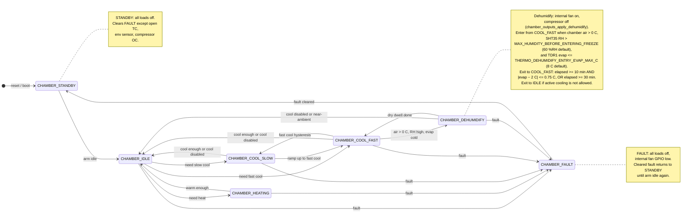
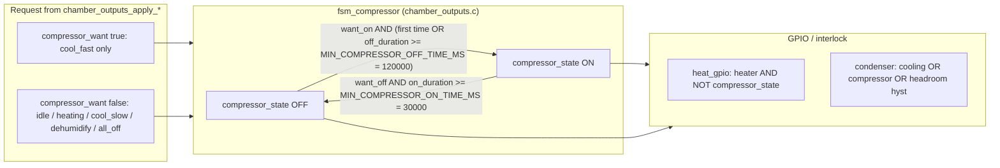
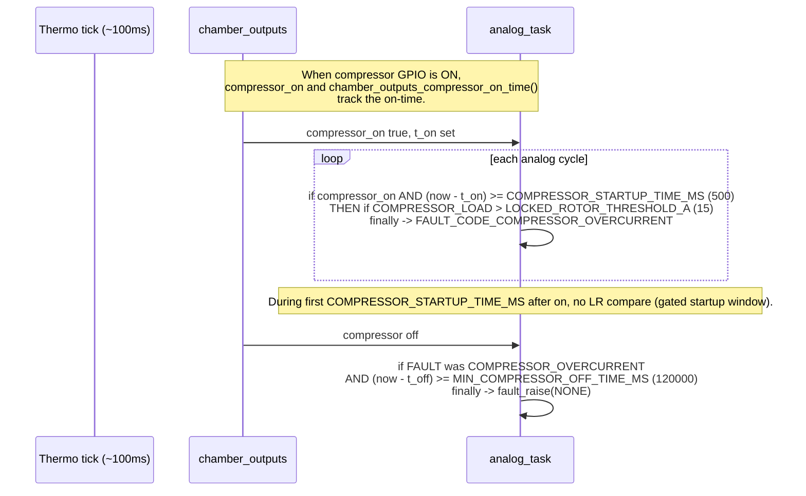

# Team Thermocline Chamber Firmware

This is built with the [Pico-SDK](https://github.com/raspberrypi/pico-sdk/blob/master/external/pico_sdk_import.cmake) and meant to run
on an [RP2040](https://pip-assets.raspberrypi.com/categories/814-rp2040/documents/RP-008371-DS-1-rp2040-datasheet.pdf?disposition=inline)

## To build

I made this using the self-contianed self-downloading `pico_sdk_import.cmake` so all you need to do is

```shell
mkdir build
cd build
cmake ../
make
```

## To load to your Pico

### Using picotool (recommended)

After building, picotool will be available in the build directory. To load the UF2 file:

```shell
# From the build directory
./_deps/picotool-build/picotool load thermocline_controller.uf2

# Or if picotool is installed system-wide:
picotool load -f -x thermocline_controller.uf2
```

You must be in bootsel mode!

Other useful picotool commands:
```shell
# List connected Picos
picotool info

# Reboot the Pico
picotool reboot

# Reboot into BOOTSEL mode
picotool reboot -u

# Load and reboot
picotool load -f thermocline_controller.uf2

# Verify what's loaded
picotool info
```

You can also drag and drop the uf2 to the pico's startup filesystem.

## State and control diagrams

Mermaid charts derived from the code directly.

### Chamber control FSM



### Compressor contactor vs chamber mode

Nested FSM in `fsm_compressor()`; chamber states only request `compressor_want`.



### Locked-rotor check and compressor overcurrent fault


