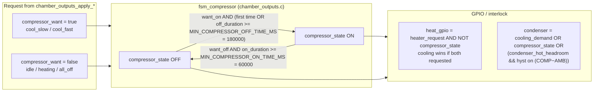
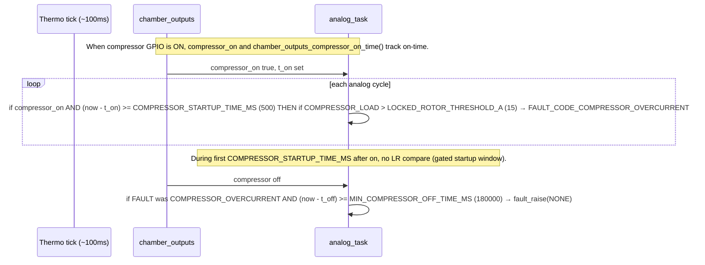

# Team Thermocline Chamber Firmware

This is built with the [Pico-SDK](https://github.com/raspberrypi/pico-sdk/blob/master/external/pico_sdk_import.cmake) and meant to run
on an [RP2040](https://pip-assets.raspberrypi.com/categories/814-rp2040/documents/RP-008371-DS-1-rp2040-datasheet.pdf?disposition=inline)

## To build

I made this using the self-contianed self-downloading `pico_sdk_import.cmake` so all you need to do is

```shell
mkdir build
cd build
cmake ../
make
```

## To load to your Pico

### Using picotool (recommended)

After building, picotool will be available in the build directory. To load the UF2 file:

```shell
# From the build directory
./_deps/picotool-build/picotool load thermocline_controller.uf2

# Or if picotool is installed system-wide:
picotool load -f -x thermocline_controller.uf2
```

You must be in bootsel mode!

Other useful picotool commands:
```shell
# List connected Picos
picotool info

# Reboot the Pico
picotool reboot

# Reboot into BOOTSEL mode
picotool reboot -u

# Load and reboot
picotool load -f thermocline_controller.uf2

# Verify what's loaded
picotool info
```

You can also drag and drop the uf2 to the pico's startup filesystem.

## State and control diagrams

Mermaid charts derived from the code directly.

### Chamber control FSM

```mermaid
stateDiagram-v2
  direction TB

  state "CHAMBER_STANDBY" as STBY
  state "CHAMBER_FAULT" as FLT
  state "CHAMBER_IDLE" as IDLE
  state "CHAMBER_HEATING" as HEAT
  state "CHAMBER_COOL_SLOW" as CSLOW
  state "CHAMBER_COOL_FAST" as CFAST

  [*] --> STBY : boot / initial\nchamber_fsm_state

  STBY --> STBY : each thermo tick:\nchamber_post_standby\n(consumed)
  STBY --> IDLE : chamber_post_arm_idle\nAND state was STANDBY

  note right of STBY
    thermo_control_task.c
    Outputs: chamber_outputs_apply_all_off
    Standby may clear FAULT unless
    THERMOCOUPLE_OPEN / ENV_SENSOR /
    COMPRESSOR_OVERCURRENT
  end note

  IDLE --> FLT : FAULT != FAULT_CODE_NONE\n(never from STANDBY path\nin same guard as ops)
  HEAT --> FLT
  CSLOW --> FLT
  CFAST --> FLT

  note right of FLT
    Any operational state except STANDBY:
    if FAULT != NONE → CHAMBER_FAULT
    Fault run: all loads off + internal fan GPIO 0
    FAULT cleared → CHAMBER_IDLE
  end note

  FLT --> IDLE : FAULT == FAULT_CODE_NONE

  IDLE --> IDLE : sp == 0.0f\n(forced each tick)
  HEAT --> IDLE : sp == 0.0f
  CSLOW --> IDLE : sp == 0.0f
  CFAST --> IDLE : sp == 0.0f

  IDLE --> HEAT : chamber <= sp - h
  IDLE --> CSLOW : cool_en AND chamber >= sp + THERMO_COOL_ENTRY_ABOVE_SP_C\nAND chamber < sp + THERMO_COOL_ENTRY_ABOVE_SP_C + THERMO_COOL_FAST_EXTRA_C
  IDLE --> CFAST : cool_en AND chamber >= sp + THERMO_COOL_ENTRY_ABOVE_SP_C + THERMO_COOL_FAST_EXTRA_C

  HEAT --> IDLE : chamber >= sp
  HEAT --> HEAT : else

  CSLOW --> IDLE : chamber <= sp + h OR NOT cool_en
  CFAST --> IDLE : chamber <= sp + h OR NOT cool_en

  CSLOW --> CFAST : cool_en AND chamber >= sp + THERMO_COOL_ENTRY_ABOVE_SP_C + THERMO_COOL_FAST_EXTRA_C
  CFAST --> CSLOW : chamber <= (sp + THERMO_COOL_ENTRY_ABOVE_SP_C + THERMO_COOL_FAST_EXTRA_C - THERMO_COOL_FAST_DOWNSHIFT_C)
  CFAST --> CFAST : else (still hot vs fast band)

  CSLOW --> CSLOW : cool_en AND chamber < fast-in threshold\n(after idle exit handled above)

  note bottom of IDLE
    chamber_transition.c
    cool_in = sp + 5°C
    cool_fast_in = sp + 10°C
    fast_down = sp + 9°C
    main.c: h = 3°C, cool_en = true
  end note
```

### Compressor contactor vs chamber mode

Nested FSM in `fsm_compressor()`; chamber states only request `compressor_want`.



### Locked-rotor check and compressor overcurrent fault (parallel to FSM)

