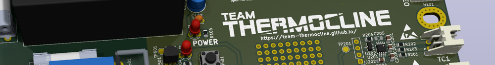

[](https://github.com/Team-Thermocline/Controller/actions/workflows/hardware_workflow.yml)
[](https://github.com/Team-Thermocline/Controller/actions/workflows/firmware_workflow.yml)

# Temperature Chamber Controller



This repo contains all the firmware and hardware for [Team Thermocline's](https://team-thermocline.github.io/) thermal chamber controller.

# Getting Started

## Clone This Repo

First, clone this repo (and optionally checkout a branch)

```shell
git clone https://github.com/Team-Thermocline/Controller.git
cd Controller
```

### Init Submodules

Some libraries and resources are included as submodules, run the following
command to initialize them before opening the main sch

(If you get a missing library error, make sure to do this)

```shell
git submodule update --init --recursive
```

## KiBot

For automated DRC, ERC and other checks and automatic outputs, this project uses [kibot]()

To run kibot locally, we reccomend using the docker version in a oneliner like this:

```shell
docker run --rm -v "$(pwd):/workspace" -v /tmp/kibot_output:/tmp/kibot_output -w /workspace ghcr.io/inti-cmnb/kicad9_auto_full:latest kibot -c Hardware/main.kibot.yaml -e Hardware/Main-Board/Main-Board.kicad_sch -b Hardware/Main-Board/Main-Board.kicad_pcb -d /tmp/kibot_output
```


## Project Layout

If you want to use this project template for yourself, you can find it [here!](https://github.com/KenwoodFox/Project-Template)
